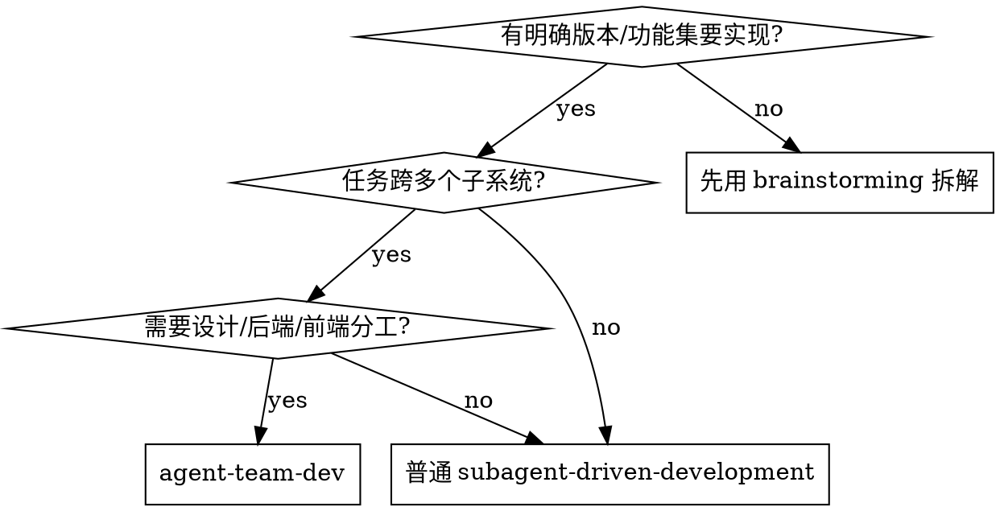

# Agent Team Development

将一个版本的开发任务分配给专职角色团队，并行执行，交叉验证，保证质量。

**核心原则：** 角色专职化 + 并行执行 + 交叉验证 = 高质量交付

## When to Use



## 角色定义

### Planner（规划者）
- **职责**：读取需求文档和代码库现状，拆解任务，分配给各角色，最终验收
- **输出**：任务列表（每条含：目标、涉及文件、验收标准）
- **运行时机**：第一个执行，其他角色等其完成后并行启动

### Designer（设计师）
- **职责**：负责所有 UI/UX 变更，包括组件设计、页面布局、交互逻辑
- **输出**：实现好的前端代码 + 截图或描述验证结果
- **运行时机**：与后端开发者并行；仅在有 UI 任务时启动

### Backend Dev（后端开发者）
- **职责**：负责 API、Store、Engine、类型定义等服务端逻辑
- **输出**：实现好的后端代码
- **运行时机**：与其他开发者并行；可按子系统拆成多个实例

### Frontend Dev（前端开发者）
- **职责**：负责前端页面逻辑、状态管理、API 对接（无 UI 设计任务时合并入此角色）
- **输出**：实现好的前端代码
- **运行时机**：与后端开发者并行

### Reviewer（审阅者）
- **职责**：独立审查所有变更，不参与实现，发现架构问题、一致性漏洞、潜在 bug
- **输出**：问题清单（按严重程度分级）
- **运行时机**：所有开发者完成后执行

### Tester（测试者）
- **职责**：从多角度验证功能：单元测试、类型检查、边界场景、回归测试
- **输出**：测试结果报告（pass/fail + 失败原因）
- **运行时机**：与 Reviewer 并行执行

## 执行流程

```
Phase 1 (串行): Planner
        ↓
Phase 2 (并行): Designer + Backend Dev(s) + Frontend Dev
        ↓
Phase 3 (并行): Reviewer + Tester
        ↓
Phase 4 (串行): 修复 Reviewer 发现的问题 + 重新运行 Tester
        ↓
Phase 5 (串行): Planner 验收 + commit
```

## Agent Prompt 模板

### Planner Prompt
```
你是 Planner（规划者）。

项目背景：[简要描述项目和当前代码状态]
目标版本：[版本号和主题]
需要实现的功能清单：[列出功能点]

任务：
1. 快速扫描相关代码文件，了解现有实现
2. 将功能清单拆解为具体开发任务，每条包含：
   - 任务描述
   - 涉及文件（精确到文件路径）
   - 验收标准
3. 将任务按角色分组：设计师任务 / 后端任务 / 前端任务
4. 输出结构化任务列表，供其他角色使用

不需要写任何代码，只做分析和拆解。
```

### Backend Dev Prompt
```
你是 Backend Dev（后端开发者）。

项目背景：[描述项目架构，关键文件路径，设计原则]
你的任务：[粘贴 Planner 分配给后端的任务列表]

实现要求：
- 遵循现有代码风格和架构模式
- 只改动任务涉及的文件，不做额外"顺手优化"
- 每个任务完成后在输出中标注 ✅

完成后输出：已修改的文件列表 + 每个任务的实现说明。
```

### Designer Prompt
```
你是 Designer（设计师）。

项目背景：[描述前端技术栈，组件目录，设计系统]
你的任务：[粘贴 Planner 分配给设计师的任务列表]

实现要求：
- 保持与现有 UI 风格一致（颜色、间距、组件库）
- 新组件放在合适的目录，遵循现有命名规范
- 描述每个 UI 变更的视觉效果

完成后输出：已修改/新增的文件列表 + UI 变更说明。
```

### Reviewer Prompt
```
你是 Reviewer（代码审阅者）。你没有参与任何实现，以全新视角审查变更。

项目背景：[描述项目架构和设计原则]
本次变更涉及的文件：[列出所有被修改的文件路径]
本次变更的目标：[描述版本目标]

审查重点：
1. 架构一致性：变更是否符合项目设计原则？
2. 完整性：有没有"半成品"——声明了能力但没有实现？
3. 类型安全：类型是否正确，有无不必要的类型断言？
4. 代码质量：命名、注释、错误处理是否合理？
5. 遗漏：有没有应该跟进修改但没有修改的地方？

输出格式：
- 🔴 严重问题（必须修复）
- 🟡 中等问题（建议修复）
- 🟢 轻微问题（可选优化）
- ✅ 做得好的地方

只读代码，不写代码。
```

### Tester Prompt
```
你是 Tester（测试者）。

项目背景：[描述项目和测试技术栈]
本次变更：[描述版本目标和主要变更]

测试任务：
1. 运行 pnpm typecheck，确认无类型错误
2. 运行 pnpm test，确认所有测试通过
3. 检查新增代码是否有对应测试覆盖
4. 针对本次变更的关键逻辑，设计边界场景并验证
5. 检查是否有遗留的 TODO/FIXME 或未处理的 edge case

输出格式：
- typecheck：pass/fail + 错误信息
- test：X passed, Y failed + 失败原因
- 覆盖率评估：哪些逻辑缺少测试
- 发现的问题清单
```

## 关键原则

**给 Agent 的 context 要精准**
- 告诉每个 agent 它需要知道的，不要把整个项目扔给它
- 粘贴关键文件路径、相关类型定义、设计原则摘要
- 不要让 agent 去猜"应该遵循什么风格"

**并行不等于无序**
- Phase 2 的开发者必须等 Planner 输出后再启动（避免方向偏差）
- Phase 3 的 Reviewer/Tester 必须等所有开发者完成后启动（否则审查对象不完整）

**Reviewer 的独立性是关键**
- Reviewer 不能和开发者是同一个 agent 实例
- Reviewer 的价值在于"第一次看到这份代码"的视角
- 不要因为 Reviewer 挑出问题而防御，直接修复

**修复阶段不再并行**
- Reviewer 发现的问题由主 session 直接修复（不再派新 agent）
- 修复完成后跑一次完整的 typecheck + test 验证
- 确认通过后再 commit

## 适配变体

**只有后端任务**（无 UI 变更）：跳过 Designer，Backend Dev 可拆成多个并行实例

**小规模修复**（1-2个文件）：跳过 Planner，直接实现 → Reviewer → Tester

**有 UI 但无后端变更**：跳过 Backend Dev，Designer + Frontend Dev 即可

## 本项目（Prism）的角色配置参考

```
Planner:
  - 读取 docs/TODO.md 了解版本目标
  - 读取 CLAUDE.md 了解架构约束

Backend Dev（可拆为多个）:
  - packages/core/        ← Store、Engine 等核心逻辑
  - packages/shared/      ← 类型定义
  - packages/server/      ← API 路由
  - packages/adapters/    ← 平台适配器

Designer:
  - apps/web/src/components/  ← UI 组件
  - apps/web/src/pages/       ← 页面

Reviewer:
  - 重点关注：卸载安全原则、类型一致性、平台适配完整性

Tester:
  - pnpm typecheck + pnpm test
  - 重点关注：适配器测试、Store 测试、路由测试
```
